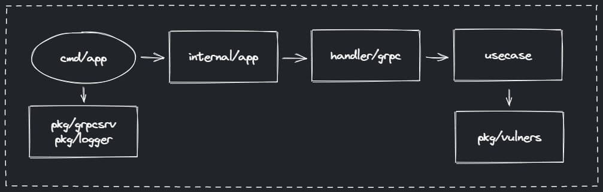

# Сервис-обертка над Nmap со скриптом vulners

### Инструкция по запуску
1. Установить [GNU make](https://www.gnu.org/software/make/) и [Docker](https://www.docker.com/)
2. Выполнить команду 'make build-docker' в терминале

или

1. Установить [GNU make](https://www.gnu.org/software/make/), [Nmap](https://nmap.org/) и последнюю стабильную версию [Go 1.x.x](https://go.dev/)  
2. Выполнить команду 'make build' в терминале

### Конфигурация
| Файл               | Настройки           |
|--------------------|---------------------|
| config/config.yaml | Уровень логирования |
| .env               | Адрес gRPC сервера  |

***
vladlen.polyakov@gmail.com